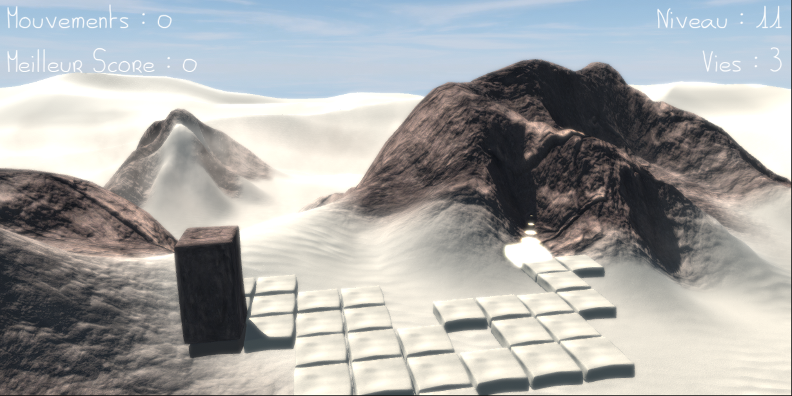

# Quboid
 Cuboid Game clone made with Unity - Version 0.26

Fonctionnalites / Fonctionalities :
- 13 niveaux // 13 levels
- Canvas avec affichage du nombre de mouvements, du meilleur score, du nombre de vies restantes, du niveau / Levels, Number of mouvements, Level Best Score, Lifes
- Moteur de jeu entre collision et gravite / Trigger & Gravity mix in Engine game
- 2 Musiques / 2 Background Musics, swith with "M" key
- Bruitages / Sounds
- Animations des Prefabs avec iTween / iTween Prefabs Animations
- Soft Particules
- Post Processing
- MacOs et Windows Builds Ok

To Do Help :
- End / Restart (ok v0.25)
- Switch Background Music (ok v0.26 with "M" key)
- French / English / Spanish Interface
- Menu
- Level Generator
- Zoom In / Out Cam
